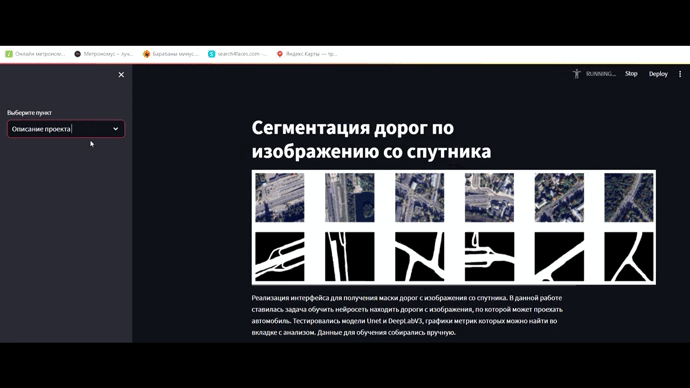

# Сегментация дорог по изображению со спутника
 

## Описание работы
Реализация интерфейса для получения маски дорог с изображения 
        со спутника. В данной работе ставилась задача обучить нейросеть
        находить дороги с изображения, по которой может проехать автомобиль.
        Тестировались модели **Unet** и **DeepLabV3**. Данные для обучения собирались вручную. 
## Демо интерфейса

## Структура проекта
- **backend**   
бэкенд часть
- **config**  
конфигурационный файл со значениями переменных
- **data**  
Различные данные. images - исходные фотографии со спутника, groundtruth - метки фотографий из папки images.
- **frontend**  
фронтенд часть
- **notebooks**   
Jupyter ноутбуки, в которых описана техническая часть: построение моделей, обучение и тестирование
- **report**  
Файлы с метриками и значениями функций потерь для их вывода на фронт
