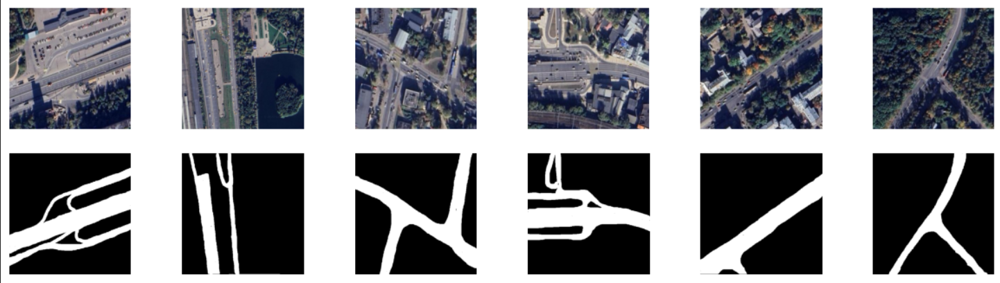

# pet roads segmentation
## Сегментация дорог по изображению со спутника

Реализация интерфейса для получения маски дорог с изображения 
        со спутника. В данной работе ставилась задача обучить нейросеть
        находить дороги с изображения, по которой может проехать автомобиль.
        Тестировались модели Unet и DeepLabV3, графики метрик которых можно 
        найти во вкладке с анализом. Данные для обучения собирались вручную.
